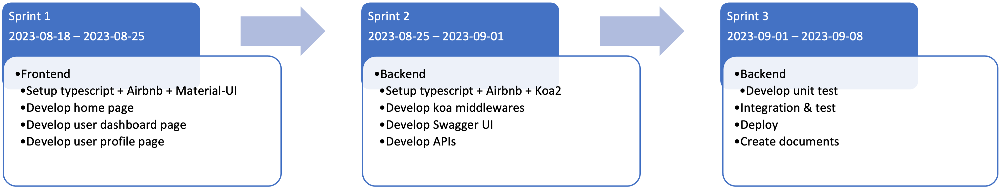

# Frontend for Auth0 Demo
This project is created for demonstrating and learning Auth0. In this project, I've quickly studied and implemented the new techniques, `Auth0`, `typescript` and `Material UI`, in around one week as shown in the timesheet figure.

# Technology Stacks
- Language: ReactJS, Typescript
- 3rd-Party Packages: auth0-react, material-ui
- Coding Styles: Airbnb
- Hosting: [Render](https://render.com)

# Features
- ✅ Sign up
  - Users can sign up by email/password, Google or Facebook
- ✅ User Defined Password
  - Users can use the defined password when they sign up, reset password, or change password
- ✅ Email Verification
  - A verification email will be sent to users when they sign up or change email
- ✅ Login
  - Users can login the system by email/password, Google or Facebook
- ✅ User Profile
  - Users can see and update their profile information after they login the system
- ✅ Cookies and Logout
  - Users can use the logout button in the profile page or the avatar menu to clear browser cookies and logout from system
- ✅ User Database Dashboard
  - Users can see a user list and search specific users after they login the system
- ✅ User Statistics
  - Users can see some statistics information on the top of the user list after they login the system
- ✅ [Extra] Delete user account
  - Users can delete their own accounts from the profile page
- ✅ [Extra] Theme
  - A theme feature is implemented for theme change in the future
- ✅ [Extra] Multi-Language
  - A multi-language feature is implemented for language change in the future

# Demo
Here's a quick overview of the web app. You can also access the frontend service [here](https://portal-bpu0.onrender.com).

Please be aware that our service is deployed on Render, which comes with a [limitation](https://render.com/docs/free#free-web-services). It may spin down the service after 15 minutes of inactivity, and it resumes service within a few seconds when a request is made. This might result in a latency for incoming requests.

# How to Use
* Auth0
  * Signup [Auth0](https://auth0.com/)
  * Create a `Single Page Application` for implicit flow
  * Create universal login UI
* Backend
  * Start backend service
* Environment setup
  * Add Auth0 secrets & backend URL to `.env` file
  * Install packages: `npm i`
  * Start service: `npm start`